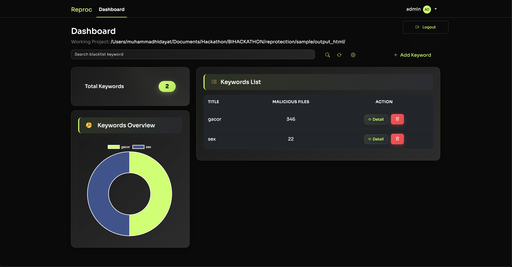

# 

# Reprotection Dashboard

> **A Modern, Secure, and Powerful Blacklist Keyword Management Platform**

[](https://golang.org/) [](LICENSE)

---

## 🚀 Overview

**Reprotection** is a robust dashboard for managing and monitoring blacklist keywords and malicious file detection. Designed for security teams and administrators, it provides a seamless interface to add, review, and analyze potentially harmful keywords and their associated files in real time.

---

## ✨ Features

- 🔍 **Search & Filter**: Instantly search and filter blacklist keywords.
- 📊 **Keyword Analytics**: Visualize keyword distribution with modern charts.
- 🗂️ **Malicious File Tracking**: See which files are flagged as malicious per keyword.
- ➕ **Add/Remove Keywords**: Manage your blacklist with ease.
- ⚙️ **Project Configuration**: Set and update your working project path.
- 🛡️ **Authentication**: Secure access with user management.
- 🧩 **Modular Structure**: Clean, maintainable Go backend and Bootstrap frontend.

---

## 🛠️ Tech Stack

- **Backend**: [Go (Golang)](https://golang.org/)
- **Frontend**: [Bootstrap 5](https://getbootstrap.com/)
- **Database**: [SQLite/PostgreSQL/MySQL] (configurable)
- **ORM**: GORM
- **Templating**: Go HTML Templates
- **Charts**: Chart.js

---

## 📦 Project Structure

```text
reprotection/
├── cmd/                # CLI tools (user creation, migrations)
├── config/             # Configuration files (DB, session, migration)
├── controllers/        # HTTP controllers (auth, config, item)
├── main.go             # Main entry point
├── middleware/         # Authentication middleware
├── migrations/         # SQL migration scripts
├── models/             # Data models (User, Item)
├── remover.go          # File removal logic
├── sample/             # Sample data and HTML outputs
├── static/             # Static assets (CSS, JS)
├── views/              # HTML templates
└── README.md           # This file
```

---

## ⚡ Getting Started

### 1. Clone the Repository

```bash
git clone https://github.com/yourusername/reprotection.git
cd reprotection
```

### 2. Install Dependencies

Ensure you have Go 1.20+ installed.

```bash
go mod tidy
```

### 3. Run Database Migrations

```bash
go run cmd/migrate/main.go
```

### 4. Create an Admin User

```bash
go run cmd/create_user/main.go
```

### 5. Start the Server

```bash
go run main.go
```

The dashboard will be available at [http://localhost:8080](http://localhost:8080)

---

## 🖼️ Screenshots

> Replace with your own screenshots for a better showcase!


---

## 🤝 Contributing

Contributions are welcome! Please open issues and submit pull requests for new features, bug fixes, or improvements.

1. Fork the repository
2. Create your feature branch (`git checkout -b feature/AmazingFeature`)
3. Commit your changes (`git commit -m 'Add some AmazingFeature'`)
4. Push to the branch (`git push origin feature/AmazingFeature`)
5. Open a Pull Request

---

## 📄 License

This project is licensed under the MIT License. See the [LICENSE](LICENSE) file for details.

---

## 📬 Contact

- **Author:** Muhammad Hidayat
- **Email:** [your.email@example.com](mailto:your.email@example.com)
- **GitHub:** [yourusername](https://github.com/yourusername)

---

> **Reprotection** – Secure your projects, empower your team.
